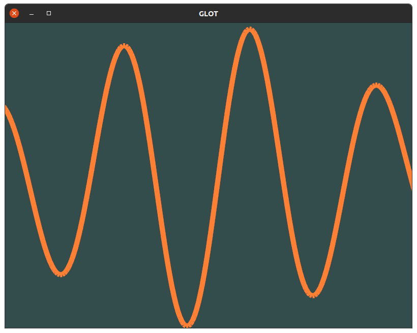

# GLot
[](https://github.com/stevegolton/glot/actions)

> :warning: **This project is still in its feasibility phase, and thus is not much more than an experiment right now!**

## Intro
GLot is (going to be) a GPU-accelerated, oscilloscope-like desktop application for Windows, Linux and Mac, used for displaying, logging, and exploring high-frequency signals (i.e. time series data) from arbitrary sources such as robots, servers, data loggers, sound cards, and microcontrollers.

Much like an oscilloscope, GLot will display these signals as a 2D graph view with time along the X axis, and signal value up the Y axis. GLot will provide intuitive controls for navigating the graph (e.g. scrolling around, zooming in and out on combined & individual axes, zooming in on specific events with a selection tool), and will be fast and responsive even when displaying very high frequency data. The graph display will be designed to give you as much information about the signal as possible at every zoom level without making any assumptions, for example, by showing average value + error bars when there is more than data point per pixel.

Ultimately, data sources shall be provided via plugins, allowing users to easily get data from custom sources into GLot.

GLot is designed to fill a hole that I have personally encountered so many times while working as an embedded software engineer: I can get data off my embedded device but have no decent way to view and explore it! There are alternatives (see the [Alternatives](#alternatives) section for a list), and while there are plenty of quality tools out there, I've found all of them to be lacking in at least one important manner.

So far, GLot is far from complete. It's just an example project which I am using to test the graph renderer using OpenGL, and the best way to draw other UI elements such as menus and buttons which is currently using imgui.

## Building
Glot uses [Conan](http://conan.io/) to manage its dependencies, which makes it easier to build on Windows (and hopefully MacOS). So far, GLot has been tested on Ubuntu 20.04 and Windows 10, but it may well work on other Ubuntu/Debian versions and Windowses thanks to Conan.

### Ubuntu 20.04
Install python, then install conan:
```bash
sudo apt install python3-pip build-essential cmake git
pip3 install conan
```

Configure conan to use the C++11 abi compatible version of the standard library.
```bash
conan profile update settings.compiler.libcxx=libstdc++11 default
```

Clone this repo then cd into the root:
```bash
mkdir build && cd build
CONAN_SYSREQUIRES_MODE=enabled conan install ..
cmake -DCMAKE_MODULE_PATH=${PWD} ..
cmake --build .
```

Run GLot with:
```
./glot
```

You should see something like this:


Use the scroll wheel to zoom in and out, and use the left mouse button to drag the canvas around.

## Windows 10
First make sure to install `git` and `cmake` and make sure they are in your `PATH`.

Make sure to install Visual Studio (Community Edition will do) - glot has been tested with the 2019 version. Cmake should pick this up automatically.

Install conan using the installer https://conan.io/downloads.html or using pip if you have python installed already.

Clone this repo then cd into the root:
> Note: GTest doesn't appear to work on Windows, so we just disable testing with `-DBUILD_TESTS=OFF`
```ps
mkdir build
cd build
conan install ..
cmake "-DCMAKE_MODULE_PATH=$((pwd).path -replace '\\', '/')" -DBUILD_TESTS=OFF ..
cmake --build .
```

If compilation on the command line isn't your bag, cmake should have generated a VS project in `glot/build/glot.vcxproj` which you can open up in Visual Studio and tinker with.

You can run the executable using:
```ps
.\Debug\glot.exe
```

Or of you built it in release mode:
```ps
.\Release\glot.exe
```

As in the linux version, use the scroll wheel to zoom in and out, and use the left mouse button to drag the canvas around.

## Alternatives
- [PlotJuggler](https://www.plotjuggler.io/)

## Additional Notes
### Using with clangd
```
cd build
cmake -DCMAKE_MODULE_PATH=${PWD} -DCMAKE_EXPORT_COMPILE_COMMANDS=1 ..
```

From the root dir, make a symlink to `compile_commands.json` in the build dir.
```
ln -s build/compile_commands.json .
```

## Fonts
Fonts are from: https://opengameart.org/content/8x8-ascii-bitmap-font-with-c-source
