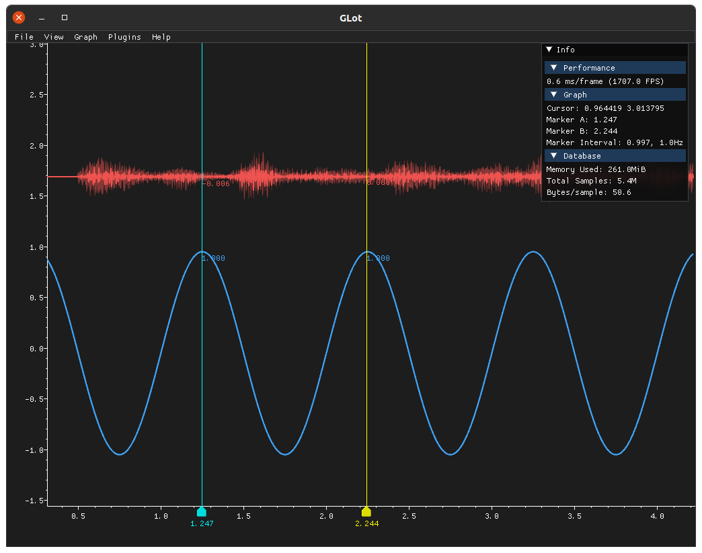
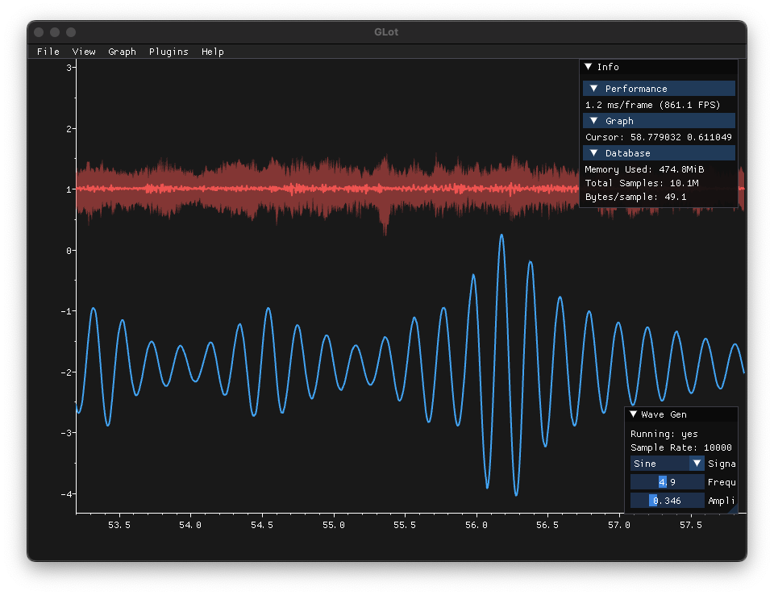
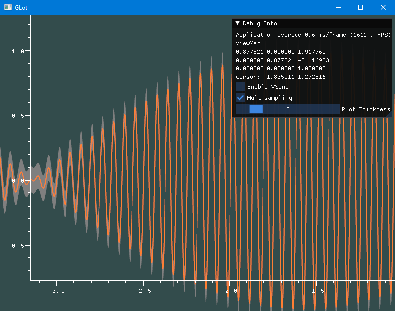

[](https://github.com/baba-GNU-sh/glot/actions)
[](https://codecov.io/gh/baba-GNU-sh/glot)

> :warning: **This project is under heavy development, and thus is unlikely to be very useful to anyone in its current state!**

# Introduction

GLot is (going to be) an OpenGL oscilloscope-like desktop graphing application for Windows, Linux and Mac, used for exploring high-frequency time-series data signals from arbitrary sources such as robots, servers, data loggers, sound cards, USB oscillioscopes, USB logic analyzers, and custom microcontrollers.

Much like an oscilloscope, GLot will display these signals as a 2D graph view with time along the X axis, and signal value up the Y axis. GLot will provide intuitive controls for navigating the graph (e.g. scrolling around, zooming in and out on combined & individual axes, zooming in on specific events with a selection tool), and will be fast and responsive even when displaying large amounts of high frequency data. The graph display will be designed to give you as much information about the signal as possible at every zoom level without making any assumptions, for example, by showing average value + error bars when there is more than data point per pixel.

Ultimately, data sources shall be provided via plugins, allowing users to easily get data from custom sources into GLot.

GLot is designed to fill a hole that I have personally encountered many times while working as an embedded software engineer: I can get data off my embedded device but have no decent way to view and explore it! There are alternatives (see the [Alternatives](#alternatives) section for a list), and while there are plenty of quality tools out there, I've found all of them to be lacking in at least one important way factor.

So far, GLot is far from complete. It's just an example project which I am using to test the graph renderer using OpenGL, and the best way to draw other UI elements such as menus and buttons, for which I am currently using ImGui.

# Design Philosophy

GLot will feature the following features:

- Keep recording data 'til your memory is full (no fixed size ring buffer).
- Target 60FPS even on modest integrated laptop graphics.
- Builds and runs on Windows and Linux - see [actions](/actions).
- Always show the most useful information possible, regardless of the zoom level.

# Screenshots






# How to build

Glot uses [Conan](http://conan.io/) to manage its dependencies, which makes it easier to build on Windows (and hopefully MacOS). So far, GLot has been tested on Ubuntu 20.04 and Windows 10, but it may well work on other distros and Windowses thanks to Conan.

## Ubuntu

Install python, then install conan:

```bash
sudo apt install python3-pip build-essential cmake git
pip3 install conan
conan profile update settings.compiler.libcxx=libstdc++11 default
```

Clone this repo then cd into the root:

```bash
mkdir build && cd build
CONAN_SYSREQUIRES_MODE=enabled conan install ..
cmake -DCMAKE_MODULE_PATH=${PWD} -DCMAKE_BUILD_TYPE=Debug ..
cmake --build .
```

Run GLot with:

```bash
./glot
```

## OSX

First, install the developer tools for mac, which should install things like clang and make. Then install homebrew, and with it install conan and cmake.

Clone this repo, and from within the root of the cloned workspace, run:

```zsh
mkdir build && cd build
conan install .. -s build_type=Debug --build missing
cmake -DCMAKE_MODULE_PATH=${PWD} -DCMAKE_BUILD_TYPE=Debug ..
cmake --build .
```

Run GLot with:

```zsh
./glot
```

## Windows

### Install Required Tools

Download and install the following tools:

- `cmake` <https://cmake.org/download/>
- `conan` <https://conan.io/downloads.html>

Make sure `cmake`, and `conan` are available in your `PATH`. Specifically you should be able to run `cmake --version` and `conan --version` in cmd or PowerShell and get something that looks like this:

```powershell
PS C:\Users\steve> cmake --version
cmake version 3.22.1

CMake suite maintained and supported by Kitware (kitware.com/cmake).
PS C:\Users\steve> conan --version
Conan version 1.44.1
```

You will also need to get hold of the MSVC compiler from somewhere. I would recommend installing Visual Studio Community Edition. GLot has been tested with the 2019 or 2022 editions.

Clone this repo then cd into into the newly created dir. Now rung the following to make a build:

```powershell
mkdir build
cd build
conan install .. -s build_type=Debug
cmake "-DCMAKE_MODULE_PATH=$((pwd).path -replace '\\', '/')" ..
cmake --build . --config Debug
```

Now you can run GLot with the following command:

```powershell
.\build\Debug\glot.exe
```

Cmake should have generated a VS solution in `build/glot.sln` which you can open up in Visual Studio, and debug and build directly from there. Just make sure to select the `main` project as the startup application.

## Running Tests

GLot comes with a suite of tests and performance benchmarks.

> Note: this only works with `gcc` on Linux AFAIK.

```bash
mkdir build && cd build
CONAN_SYSREQUIRES_MODE=enabled conan install ..
cmake -DCMAKE_MODULE_PATH=${PWD} -DCMAKE_BUILD_TYPE=Debug -DBUILD_TESTS=ON -DUSE_COVERAGE=ON -DUSE_SANITIZERS=ON ..
cmake --build .
ctest --verbose
```

Generate a report using gcovr, and opening the results in a web browser

```bash
gcovr --root .. --html-details -o coverage.html
firefox coverage.html
```

## Running Benchmarks

Performance is an important part of glot, so some benchmarks are also available, mainly oriented around accessing timeseries data.

```bash
mkdir build && cd build
CONAN_SYSREQUIRES_MODE=enabled conan install ..
cmake -DCMAKE_MODULE_PATH=${PWD} -DCMAKE_BUILD_TYPE=Release -DBUILD_BENCHMARKS=ON ..
cmake --build .
ctest --verbose
```

## Alternatives

- [PlotJuggler](https://www.plotjuggler.io/)

## Additional Notes

### Using with clangd

```bash
cd build
cmake -DCMAKE_MODULE_PATH=${PWD} -DCMAKE_EXPORT_COMPILE_COMMANDS=1 ..
```

From the root dir, make a symlink to `compile_commands.json` in the build dir.
```
ln -s build/compile_commands.json .
```

## Fonts
GLot uses the font ProggyClean by Tristan Grimmer. This is pre-rendered out to a bitmap font atlas in `font.png`.
